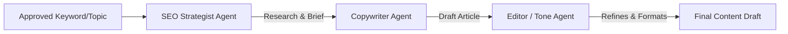

# Strategic Roadmap: Upgrading Moyi AI CMO for SaaS & SMEs

To transform **Moyi AI CMO** from a feature-rich MVP into an indispensable tool that solves actual growth problems for startups and SMEs, we must focus on **reducing time-to-value (TTV)**, **generating high-intent conversions**, and **automating manual workflows**.

Below is a structured plan outlining key functional, architectural, and business value upgrades.

---

## 🚀 1. Value Proposition & Feature Upgrades

SMEs and early-stage SaaS teams are resource-constrained. They don't want generic SEO checklists; they want customers.

### A. High-Intent Content Templates
- **Problem**: SMEs waste time writing generic articles that don't convert.
- **Solution**: Add dedicated templates for high-conversion content types:
  - **"Vs" Comparison Pages**: e.g., *OurSaaS vs. CompetitorX* (Crucial for SaaS).
  - **Alternative Pages**: e.g., *Top 5 Alternatives to [Industry Leader]*.
  - **Product-Led Blog Posts**: Articles structured specifically to present the product as the solution.

### B. "Low-Hanging Fruit" Opportunity Finder
- **Problem**: Raw Google Search Console (GSC) data is overwhelming.
- **Solution**: Auto-calculate quick-win opportunities by querying synced GSC metrics:
  - **Boost CTR**: Find pages ranking on page 1 (positions 1–10) but with a CTR below average. Suggest meta-title/meta-description revisions.
  - **Push to Page 1**: Identify keywords ranking in positions 11–20 with high impressions. Suggest adding specific subheadings or sections to cross page 1.

### C. Direct ROI & Lead Attribution Dashboard
- **Problem**: Traditional analytics tools show traffic, not business value.
- **Solution**: Connect the first-party analytics tracker directly to conversion goals:
  - Show which landing page or blog article directly initiated a sign-up or checkout event.
  - Attribute sign-ups to specific UTM campaigns or organic search terms.

### D. Multi-CMS Integrations
- **Problem**: Many modern startups and SMEs do not use WordPress (they use Webflow, Shopify, Framer, Ghost, or headless next.js).
- **Solution**:
  - Implement Webflow CMS API connector.
  - Implement Shopify Article API connector.
  - Create a generic webhook system that fires when a draft is approved, allowing custom frontends to ingest content.

---

## 🤖 2. AI Architecture Upgrade: Multi-Agent Workflows

The current implementation uses simple single-prompt completions. We can dramatically improve content quality and reduce "AI-sounding" text by introducing a multi-agent pipeline.

1. **SEO Strategist Agent**: Analyzes top-ranking search results for a keyword and creates an outline (H1s, H2s, target keywords).
2. **Copywriter Agent**: Generates a deep, narrative draft based on the strategist's outline and the company's brand tone guide.
3. **Editor / Tone Agent**: Critiques the draft, eliminates fluff, ensures exact brand terminology, and structures metadata.

---

## 💻 3. Technical & Scalability Upgrades

### A. Full Queue Architecture (Redis/BullMQ)
- **Problem**: Running crawls and AI analysis synchronously blocks the main Node thread and times out browser requests.
- **Solution**:
  - Transition all scanning, competitor crawling, and AI report generation to run asynchronously through BullMQ.
  - Provide a clean WebSockets connection (using `socket.io`) or Server-Sent Events (SSE) to update the dashboard UI in real time as scanning progresses.

### B. Smart Competitor Intelligence
- **Problem**: Crawling competitors blindly can get the server's IP banned.
- **Solution**:
  - Implement proxy rotation for the crawler.
  - Scan competitor sitemaps (`sitemap.xml`) to identify newly published pages without crawling their entire site.
  - Track changes in competitor homepage headlines and meta descriptions over time.

---

## 🎨 4. User Experience (UX) Optimizations

1. **One-Click Onboarding**:
   - Ask the user only for their domain name and a description of their product.
   - Proactively fetch basic domain details, scrape the homepage, suggest GSC oauth, and run the first scan automatically.
2. **Interactive Content Calendar**:
   - Provide a visual drag-and-drop calendar view for campaigns and scheduled draft dates.
3. **Weekly Growth Email**:
   - Send an automated email newsletter summarizing:
     - 📈 Organic search clicks gained/lost.
     - 🚀 Top 3 recommended actions for the week.
     - 📝 Drafts waiting in the approval queue.

