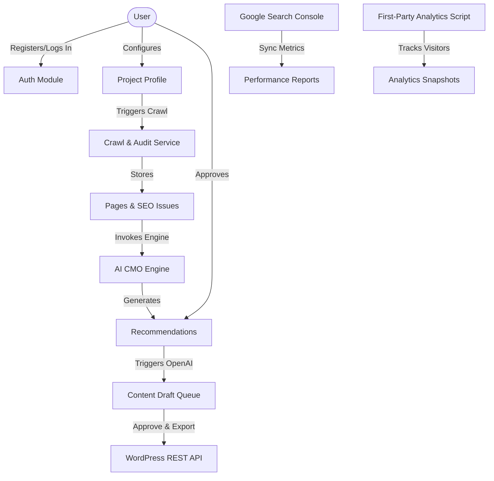

# Moyi AI CMO - Project Summary

**Moyi AI CMO** is a SaaS-ready platform designed to act as an AI-powered Chief Marketing Officer. Built on Node.js, Express, MongoDB, and EJS, it helps businesses crawl their websites, diagnose SEO issues, generate actionable marketing recommendations, draft SEO/marketing content, track competitors, sync search console metrics, record first-party traffic analytics, and schedule content campaigns.

Below is a breakdown of the application architecture, stack, modules, database schema, and services.

---

## 🛠 Technology Stack

- **Backend Framework**: Node.js & Express
- **Database**: MongoDB with Mongoose ODM
- **Frontend Template Engine**: EJS (Embedded JavaScript templates)
- **Authentication**: JWT Cookie-based auth with bcryptjs password hashing
- **Queueing / Background Jobs**: BullMQ and Redis (with fallback in-memory or sync execution options via `DISABLE_QUEUE`)
- **API integrations**: 
  - **OpenAI**: Core reasoning engine for SEO reports, recommendations, and content drafts.
  - **Google OAuth**: Access to Google Search Console readonly data.
  - **Stripe**: Pricing pages, customer portal redirects, and payment status hooks.
  - **WordPress REST API**: Exporting approved article drafts directly to user websites.
- **Web Crawler**: Axios & Cheerio

---

## 📁 Project Architecture & Components

The application is structured into standard MVC-like layers with dedicated services for AI reasoning and integrations:

### 1. Database Models (`models/`)
Each file defines a MongoDB schema representing a domain entity:
- [User.js](file:///home/brandon/Moyi/models/User.js): User profile, role, password hashing, and Stripe subscription status.
- [Project.js](file:///home/brandon/Moyi/models/Project.js): Scoped business profiles containing fields like `industry`, `targetAudience`, `targetCountry`, and `mainGoal`.
- [Page.js](file:///home/brandon/Moyi/models/Page.js): Stored page details from crawler scans (headings, meta data, Open Graph, word count, etc.).
- [SeoIssue.js](file:///home/brandon/Moyi/models/SeoIssue.js): Diagnosed SEO problems categorized by severity.
- [Recommendation.js](file:///home/brandon/Moyi/models/Recommendation.js): AI-generated suggestions linked to specific SEO issues and target pages.
- [ContentDraft.js](file:///home/brandon/Moyi/models/ContentDraft.js): OpenAI-generated draft copy (blog posts, FAQs, metadata) in a review queue.
- [GoogleIntegration.js](file:///home/brandon/Moyi/models/GoogleIntegration.js) & [WordPressIntegration.js](file:///home/brandon/Moyi/models/WordPressIntegration.js): Encrypted OAuth credentials and REST API credentials.
- [SearchMetric.js](file:///home/brandon/Moyi/models/SearchMetric.js) & [ProjectSearchProperty.js](file:///home/brandon/Moyi/models/ProjectSearchProperty.js): GSC queries, clicks, impressions, and property mapping.
- [TrackingEvent.js](file:///home/brandon/Moyi/models/TrackingEvent.js), [ConversionGoal.js](file:///home/brandon/Moyi/models/ConversionGoal.js), & [AnalyticsSnapshot.js](file:///home/brandon/Moyi/models/AnalyticsSnapshot.js): First-party page views, referral parameters, and goals.
- [Campaign.js](file:///home/brandon/Moyi/models/Campaign.js) & [SocialDraft.js](file:///home/brandon/Moyi/models/SocialDraft.js): Content calendar mappings and social network drafts.
- [Usage.js](file:///home/brandon/Moyi/models/Usage.js): Tracker for usage limits matching Stripe plans (projects, scans, drafts, reports).

### 2. Business Logic Services (`services/`)
These contain the core engines of the platform:
- [crawlerService.js](file:///home/brandon/Moyi/services/crawlerService.js): Responsible for domain-locked queue-based or synchronous web crawling.
- [auditService.js](file:///home/brandon/Moyi/services/auditService.js): Examines the crawled [Page](file:///home/brandon/Moyi/models/Page.js) records to automatically flag issues (e.g., missing titles, short pages, incorrect canonicals).
- [aiReportService.js](file:///home/brandon/Moyi/services/aiReportService.js): Instructs OpenAI using system prompt guidelines to convert crawled audit issues into actionable plans.
- [contentDraftService.js](file:///home/brandon/Moyi/services/contentDraftService.js): Formulates content drafts (like FAQ sections and blog articles) based on recommendations.
- [searchConsoleService.js](file:///home/brandon/Moyi/services/searchConsoleService.js): Handles Google OAuth flows, token refresh, and syncing performance data.
- [cmoReportService.js](file:///home/brandon/Moyi/services/cmoReportService.js): Generates high-level weekly and monthly marketing executive reports summarizing GSC metrics and open marketing items.
- [competitorCrawlerService.js](file:///home/brandon/Moyi/services/competitorCrawlerService.js) & [competitorInsightService.js](file:///home/brandon/Moyi/services/competitorInsightService.js): Performs shallow crawls on manually specified competitors to compute public SEO comparisons.
- [wordpressService.js](file:///home/brandon/Moyi/services/wordpressService.js): Dispatches approved content drafts to connected WordPress installations.
- [trackingService.js](file:///home/brandon/Moyi/services/trackingService.js): Serves the frontend web analytics script and records raw request events securely.
- [stripeService.js](file:///home/brandon/Moyi/services/stripeService.js): Manages checkout configurations and portals.
- [usageService.js](file:///home/brandon/Moyi/services/usageService.js): Validates current consumption metrics against subscription plans.

### 3. Route Handlers (`routes/`)
Coordinates requests, authentication middleware, parameters validation, and template rendering:
- [auth.js](file:///home/brandon/Moyi/routes/auth.js): Handles registration, login, session validation.
- [projects.js](file:///home/brandon/Moyi/routes/projects.js): Orchestrates project configuration, crawler scans, search console dashboards, analytics dashboards, and competitor insights.
- [content.js](file:///home/brandon/Moyi/routes/content.js): Handles draft editing, updates, approval, rejection, and WordPress publishing.
- [recommendations.js](file:///home/brandon/Moyi/routes/recommendations.js): Manages recommendation approvals and invokes draft creation.
- [reports.js](file:///home/brandon/Moyi/routes/reports.js): Views weekly/monthly report runs.
- [billing.js](file:///home/brandon/Moyi/routes/billing.js) & [stripeWebhook.js](file:///home/brandon/Moyi/routes/stripeWebhook.js): Webhook event processors updating the database with subscription changes.
- [tracking.js](file:///home/brandon/Moyi/routes/tracking.js): Registers client events and serves the tracker script.

---

## 📈 Platform Workflow

## 🛡 Ethical Guardrails & Constraints
Throughout the platform services, several strict rules are coded into AI prompt parameters:
1. **No Keyword Stuffing**: The generated content must remain natural.
2. **No Factual Invention**: AI prompts warn against hallucinating site pages, numbers, or competitive metrics.
3. **No Automatic CMS/Social Posting**: Changes are stored in approval queues requiring human verification before delivery.
4. **Privacy-Friendly Tracker**: Raw IP addresses are encrypted using salted hashes, and the tracker respects the browser `DNT` (Do Not Track) flag.
