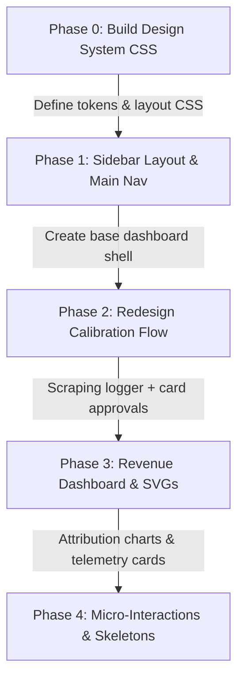

# DESIGN SPEC: Moyi AI CMO World-Class SaaS Redesign Plan

## 1. Design Philosophy: "Serious SaaS, Not AI Slop"
To build trust with founders and CMOs managing real budgets, Moyi must look like an authoritative, high-density growth platform (similar to Linear, Vercel, or Stripe), avoiding generic templates with excessive purple glows, heavy gradients, or placeholder-heavy spaces.

### Design Tokens
*   **Typography:**
    *   Headers: **Outfit** or **Plus Jakarta Sans** (clean, geometric sans-serif for high-end headers).
    *   Body: **Inter** or **SF Pro** (data-dense, highly readable).
*   **Color Palette (Serious Slate Dark Mode):**
    *   `--background`: `#09090b` (Deep near-black charcoal).
    *   `--surface`: `#18181b` (Muted dark gray card backgrounds).
    *   `--surface-raised`: `#27272a` (Elevated components).
    *   `--accent`: `#4f46e5` (Deep indigo - crisp, not neon).
    *   `--text-primary`: `#fafafa` (Bright, off-white).
    *   `--text-muted`: `#a1a1aa` (Cool, readable gray).
    *   `--border`: `rgba(255, 255, 255, 0.08)` (Thin borders).
*   **Semantic Accents:**
    *   `--success`: `#10b981` (Emerald green).
    *   `--warning`: `#f59e0b` (Warm amber).
    *   `--error`: `#ef4444` (Coral red).
    *   `--success-bg`: `rgba(16, 185, 129, 0.1)`.
*   **Layout Rules:**
    *   Use a **Sidebar Navigation Layout** instead of a topbar header for dashboard routes.
    *   Enforce grid alignment with constant padding (`24px`).
    *   Utilize **shimmering loading skeletons** for charts and list panels.

---

## 2. Key Screen Redesigns

### A. The "Scan Command Center" & Calibration Dashboard
*   **Old Design:** Form text boxes requiring the user to type in their brand voice and competitors, creating manual data entry work.
*   **New Design:**
    *   **The Scanner Page (`/projects/new`):** While crawling, the page displays a live terminal-like diagnostic tracker showing the steps the scraper and CrewAI agents are executing:
        *   `[CRAWLER] Scanning homepage ... OK`
        *   `[SCOUT] Identifying competitive domains ... OK`
        *   `[LLM] Synthesizing customer personas ... OK`
    *   **The Calibration Page (`/projects/calibration`):** Renders the discovered data as pre-filled, interactable cards:
        *   *Left Column:* Brand Identity & Value Props (editable modals, single-click tag deletions).
        *   *Right Column:* Discovered Competitors (rendered as a horizontal comparison matrix comparing keywords, value props, and active Meta ad counts).
        *   *Personas Panel:* Horizontal slider cards displaying target buyer profiles with objections and suggested copy angles.
        *   *CTA:* One-click "Confirm & Initialize CMO" button.

### B. The Revenue-Attribution Command Center (`/projects/:id/attribution`)
*   **Old Design:** A list or table showing metrics with no visual context.
*   **New Design:**
    *   **KPI Summary Grid:** 4 premium, flat card widgets displaying:
        *   `Net Attributed Revenue` (USD formatting).
        *   `Blended CAC` (with color indicators for target compliance).
        *   `Average Payback Period` (pills showing days).
        *   `Attribution Confidence Score (ACS)` (a large dial showing 0-100%, with a tool-tip explaining modern tracking limitations like iOS 14.5+).
    *   **The Attribution Flow Chart:** An SVG-based horizontal flowchart showing how organic search, social ads, and email nurture campaigns lead to sales, highlighting the W-Shaped weighting points (First, Lead Conversion, Last).
    *   **Attribution table:** A data grid with column sorting, displaying actual Stripe payment timestamps, Customer Email, solved UTM paths, and weight scores by model (Linear vs. W-Shaped).

### C. The Telemetry & Integration Dashboard
*   **Old Design:** A simple checklist reporting a static score.
*   **New Design:**
    *   **Verification Status Cards:** A clean dashboard split by integration types:
        *   *GA4 Script status:* Displays a script snippet with a button to "Verify Installation" (sends a real-time cURL to verify the Moyi script tag is physically present on their server).
        *   *Stripe API status:* Verifies if webhook events are active (shows a "Last Ping: 2 minutes ago" status indicator).
        *   *GSC Status:* Verifies read permissions (shows client OAuth domains).
    *   **Autonomous Lock Indicator:** A clean banner explaining if autonomous actions are blocked because the Telemetry Score is under 85% (transparency requirement).

---

## 3. Implementation Phases for UI Upgrades

### **Step 1: Foundational CSS Refactor (`public/stylesheets/style.css`)**
*   Rewrite the root variables inside `style.css` to match the Slate Dark Mode color palette.
*   Implement layout classes for Sidebar Nav (`.dashboard-layout`, `.sidebar`, `.content-panel`).
*   Write utility classes for flat cards, badge pills, and tabular grids.

### **Step 2: Redesign View Files**
*   Create `views/partials/sidebar.ejs` to replace the topbar navbar on authenticated routes.
*   Refactor [new.ejs](file:///home/brandon/Moyi/views/projects/new.ejs) and [calibration.ejs](file:///home/brandon/Moyi/views/projects/calibration.ejs) to utilize the card-approval schema.
*   Refactor the analytics and attribution views into data-dense grid panels.
