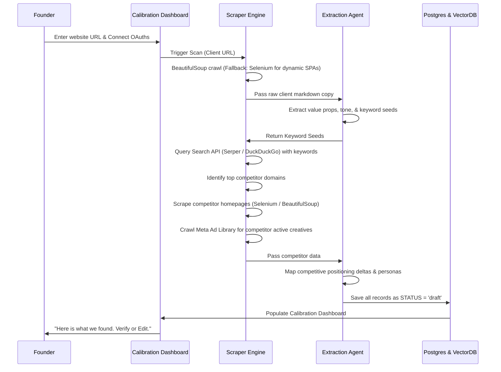

# DESIGN SPEC: AI-CMO Onboarding Auto-Discovery & Diagnostic Scraper Engine

**AI-CMO SPEC COMPLIANCE:**
*   **Requirement 2 (Low-Friction, High-Context Input):** Replaces the onboarding questionnaire with an automated website crawl and API diagnostic scan.
*   **Requirement 5 (SME Economics):** Uses a hybrid crawling model (BeautifulSoup + Selenium fallback) and local/cheap LLM synthesis to keep execution costs low.

---

## 1. Goal
To eliminate manual data entry during onboarding. The user provides only their **Website URL** and connects **account OAuths**. The engine automatically discovers:
1. The client's brand positioning, brand voice, value propositions, and primary offers.
2. The client's target customer personas and their objections.
3. Top 5-10 overlapping competitors.
4. Competitors' positioning, estimated pricing, and active ad creatives.

All extracted data is stored as "draft" records, and presented to the client on a single **Verify & Edit Calibration Dashboard**.

---

## 2. Technical Architecture & Data Flow



---

## 3. Technology Stack Integration
Derived from `/home/brandon/Deep-Research-With-Web-Scraping-by-LLM-And-AI-Agent`:

1.  **Crawling & HTML Parsing:**
    *   **Primary Scraper:** BeautifulSoup for fast, lightweight extraction of static HTML pages.
    *   **SPA/Dynamic Fallback:** Selenium driver (configured in headless mode) for modern JavaScript-heavy websites (React, Vue, Next.js).
2.  **Search API Integration:**
    *   **Google Serper API / DuckDuckGo Search:** Used to execute queries using extracted client keywords to find organic search competitors.
3.  **Ad Library Crawling:**
    *   **Meta Ad Library Scraper:** Custom Selenium-based collector that visits `facebook.com/ads/library` using the identified competitor brand names to capture active creative copy and image/video URLs.
4.  **Semantic Extraction Agent (LLM):**
    *   Uses a structured parser with LangChain/CrewAI or native JSON-schemas (via Gemini/OpenAI structured outputs) to enforce the data models defined below.

---

## 4. Target Data Models (Draft Schemas)

### A. Brand Voice & Positioning Profile
```typescript
interface DraftBrandProfile {
  companyName: string;
  coreValueProposition: string;
  tagline: string;
  toneAdjectives: string[];     // e.g. ["professional", "technical", "urgent"]
  forbiddenWords: string[];      // Auto-discovered (e.g. competitor brand names)
  pricingSummary: string;        // E.g. "$49/mo starter package, call for enterprise"
}
```

### B. Customer Personas (Auto-Extracted)
```typescript
interface DraftPersona {
  name: string;                  // E.g. "E-commerce Manager"
  demographics: string;
  painPoints: string[];          // Auto-extracted from site benefits copy
  commonObjections: string[];    // E.g. "too expensive", "hard to integrate"
  suggestedAngles: string[];     // E.g. "Highlight the 10-minute automated setup"
}
```

### C. Competitor Positioning Map
```typescript
interface DraftCompetitor {
  domain: string;
  name: string;
  valueProposition: string;
  pricingEst: string;
  activeAdsCount: number;
  adAnglesUsed: string[];        // Extracted from Meta Ad Library copy
  positioningDelta: string;      // How the client differs from this competitor
}
```

---

## 5. Phased Implementation for Scraper Engine

### **Phase 0.1: Client Scraper & Keyword Seeder**
*   Write the FastAPI endpoints in `src/` to accept a URL.
*   Implement the BeautifulSoup + Selenium crawling functions.
*   Write the LLM extraction prompt to parse the raw text into `DraftBrandProfile` variables.

### **Phase 0.2: Competitor Discovery & Ads Scan**
*   Implement the Search API lookup (querying Serper with seed keywords).
*   Scrape identified competitor homepages.
*   Connect the Meta Ad Library scraper to pull competitor ad counts and active creative briefs.

### **Phase 0.3: Calibration Dashboard API**
*   Create Postgres tables to store the draft models.
*   Create endpoints (`GET /api/v1/onboarding/calibration` and `POST /api/v1/onboarding/approve`) to read the draft profiles, allow the user to modify them, and toggle status to `approved` to initialize the Vector Memory.
